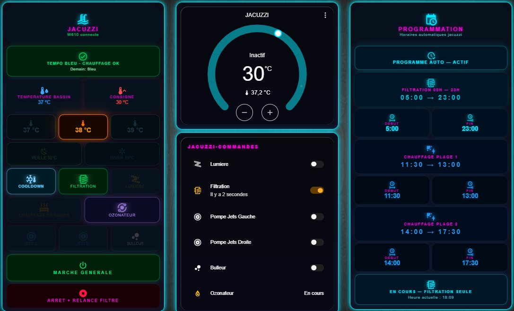

<div align="center">


# Joyonway P23B32 Spa for Home Assistant

**Native local integration for the Joyonway P23B32 spa controller via RS485 over a USR-W610 WiFi bridge.**

[](https://github.com/hacs/integration)
[](https://github.com/KnapTheBuilder/ha-joyonway-p23b32/releases)
[](LICENSE)
[](https://www.home-assistant.io)

[](https://github.com/KnapTheBuilder/ha-joyonway-p23b32/actions/workflows/hassfest.yml)
[](https://github.com/KnapTheBuilder/ha-joyonway-p23b32/actions/workflows/hacs.yml)

[Features](#features) - [Showcase](#showcase) - [Install](#installation) - [Config](#configuration) - [Entities](#entities) - [Automations](#automation-examples) - [Dashboard](#dashboard-example) - [Protocol](#protocol-details) - [Roadmap](#roadmap) - [Credits](#credits)

</div>

---

## Overview

This integration brings full Home Assistant control over the **Joyonway P23B32** spa controller. Communication is purely local via RS485, bridged to your network through a **USR-W610** WiFi-to-serial adapter in TCP server mode. No cloud, no Joyonway app, no internet required.

All commands have been reverse-engineered from RS485 captures and physically validated on a real P23B32 unit on 2026-05-11.

> **Discussion thread on HA Community:** [JoyOnWay Spa Control](https://community.home-assistant.io/t/joyonway-spa-control/582344)

---

## Features

- **Fully local control**, no cloud dependency, no internet required
- **Real-time monitoring** of water temperature, setpoint, all pumps, blower, light, heater
- **One-shot commands** to toggle every accessory, plus an "All OFF" emergency stop
- **Setpoint control** from 16 to 40 degrees Celsius (60 to 104 Fahrenheit)
- **Simple config flow**, just enter the IP and TCP port of the W610 bridge
- **Connectivity sensor** to detect when the W610 bridge is offline
- **Native HA device**, all entities grouped under one logical device with manufacturer info
- **English and French** UI translations included
- **HACS and hassfest validated**, ready for one-click HACS install

---

## Showcase

A real-world dashboard built on top of this integration, with thermostat, command panel, mode presets, EDF Tempo integration, and automatic scheduling:

<div align="center">



</div>

The dashboard uses Mushroom cards, custom button-card, and a circular thermostat card to expose every entity from the integration in a clean, mobile-friendly layout.

---

## Requirements

| Item | Details |
|------|---------|
| Spa controller | Joyonway P23B32 (physically validated, other models may need protocol adaptation) |
| RS485 bridge | USR-W610 (WiFi, TCP Server mode, port 8899, 34800 8N1) |
| Home Assistant | 2024.1.0 or later |
| Network | HA and W610 on the same LAN, no internet required |

---

## Hardware wiring

> **Warning.** Opening the spa electrical enclosure exposes you to mains voltage. Always cut the power at the breaker before any intervention. If you are not comfortable with electrical work, hire a qualified electrician.

The USR-W610 connects to the RS485 bus inside the spa controller box:

```
   Joyonway P23B32 RS485 bus
   +--------+--------+
   |   A    |   B    |
   +---|----+---|----+
       |        |
       |        |
   +---v----+---v----+
   |   A    |   B    |   USR-W610
   +--------+--------+   (5-30V DC, TCP Server mode, port 8899)
        | LAN / WiFi
        v
   Home Assistant
```

USR-W610 configuration:

- Mode: **TCP Server**
- Port: **8899**
- Baud rate: **34800**
- Data format: **8N1**
- Static DHCP lease recommended on your router for the W610

---

## Installation

### Via HACS (recommended)

1. Open **HACS** in Home Assistant
2. Click the three dots in the top right and select **Custom repositories**
3. Repository URL: `https://github.com/KnapTheBuilder/ha-joyonway-p23b32`
4. Category: **Integration**
5. Click **Add**, then find **Joyonway P23B32 Spa** in the HACS list and install
6. Restart Home Assistant

### Manual

1. Download the latest release from the [Releases page](https://github.com/KnapTheBuilder/ha-joyonway-p23b32/releases)
2. Extract the archive
3. Copy `custom_components/joyonway_p23b32/` into your Home Assistant `config/custom_components/` folder
4. Restart Home Assistant

---

## Configuration

After restart, go to **Settings > Devices & Services > Add integration** and search for **Joyonway**.

Enter:

| Field | Value |
|-------|-------|
| IP address | The IP of your USR-W610 on the local network |
| TCP port | `8899` (default) |

The integration performs a TCP connection test before saving. If the test fails, double-check that the W610 is in TCP Server mode, and that the IP and port are correct.

---

## Entities

### Sensors

| Entity | Description | Unit |
|--------|-------------|------|
| `sensor.joyonway_p23b32_water_temperature` | Current water temperature | C |
| `sensor.joyonway_p23b32_setpoint` | Target temperature setpoint | C |

### Binary sensors

| Entity | Description | Device class |
|--------|-------------|--------------|
| `binary_sensor.joyonway_p23b32_filtration` | Filtration pump active | none |
| `binary_sensor.joyonway_p23b32_pompe_gauche` | Left jets pump | none |
| `binary_sensor.joyonway_p23b32_pompe_droite` | Right jets pump | none |
| `binary_sensor.joyonway_p23b32_bulleur` | Blower (air bubbles) | none |
| `binary_sensor.joyonway_p23b32_lumiere` | Light | none |
| `binary_sensor.joyonway_p23b32_chauffage` | Heater active | `heat` |
| `binary_sensor.joyonway_p23b32_w610_connection` | USR-W610 connectivity | `connectivity` |

### Buttons (one-shot RS485 commands)

| Entity | Action |
|--------|--------|
| Light ON / OFF | Toggle the light |
| Left jets ON / OFF | Toggle the left pump |
| Right jets ON / OFF | Toggle the right pump |
| Blower ON / OFF | Toggle the blower |
| Filtration | Start the filtration cycle |
| All OFF | Emergency stop for all equipment |

> Replace `joyonway_p23b32` in entity IDs with whatever name HA assigned during setup if you renamed the integration.

---

## Automation examples

These automations are real-world examples inspired by a production install. Adapt the entity IDs to your own setup, the action keys match the integration's button entities.

<details>
<summary><b>1. Daily filtration cycle (summer schedule, 05:00 to 23:00)</b></summary>

Starts filtration every morning at 05:00 and stops the cycle at 23:00. Adjust hours to your local regulations or noise constraints.

```yaml
# 2026-05-16 | Automation | Daily filtration start (summer schedule) | Depends on: button.joyonway_p23b32_filtration
alias: Spa - Filtration start 05:00
description: Start filtration cycle every morning
mode: single
triggers:
  - trigger: time
    at: "05:00:00"
conditions: []
actions:
  - action: button.press
    target:
      entity_id: button.joyonway_p23b32_filtration

# 2026-05-16 | Automation | Daily filtration stop | Depends on: button.joyonway_p23b32_all_off, binary_sensor.joyonway_p23b32_filtration
alias: Spa - Filtration stop 23:00
description: Stop filtration at 23:00 if still active
mode: single
triggers:
  - trigger: time
    at: "23:00:00"
conditions:
  - condition: state
    entity_id: binary_sensor.joyonway_p23b32_filtration
    state: "on"
actions:
  - action: button.press
    target:
      entity_id: button.joyonway_p23b32_all_off
```
</details>

<details>
<summary><b>2. Veille mode (winter holding setpoint at 30 degrees)</b></summary>

Lowers the spa setpoint to 30 degrees during the night to save energy while keeping it ready for the morning.

```yaml
# 2026-05-16 | Automation | Night setpoint to 30C | Depends on: input_number.joyonway_setpoint (UI helper), or direct service call
alias: Spa - Veille mode 30C
description: Lower setpoint at 23:30 every day
mode: single
triggers:
  - trigger: time
    at: "23:30:00"
actions:
  - action: number.set_value
    target:
      entity_id: number.joyonway_p23b32_setpoint
    data:
      value: 30
```

Note : if you only have the button entities (current integration version), you can call the setpoint via a service template using the underlying integration `send_command`. A native `number` entity is planned for a future release.
</details>

<details>
<summary><b>3. EDF Tempo aware heating (France only)</b></summary>

Disables spa heating during EDF Tempo red days (most expensive) and raises the setpoint on blue days.

```yaml
# 2026-05-16 | Automation | Tempo red day, lower setpoint | Depends on: sensor.rte_tempo_couleur_du_jour, binary_sensor.joyonway_p23b32_chauffage
alias: Spa - Tempo red day, save mode
description: Force veille mode on EDF Tempo red days
mode: single
triggers:
  - trigger: state
    entity_id: sensor.rte_tempo_couleur_du_jour
    to: "Rouge"
conditions:
  - condition: time
    after: "06:00:00"
    before: "22:00:00"
actions:
  - action: number.set_value
    target:
      entity_id: number.joyonway_p23b32_setpoint
    data:
      value: 28
```
</details>

<details>
<summary><b>4. W610 bridge offline notification</b></summary>

Sends a notification when the USR-W610 bridge becomes unreachable for more than 5 minutes.

```yaml
# 2026-05-16 | Automation | W610 offline alert | Depends on: binary_sensor.joyonway_p23b32_w610_connection
alias: Spa - W610 bridge offline
description: Notify when the W610 has been offline for 5 minutes
mode: single
triggers:
  - trigger: state
    entity_id: binary_sensor.joyonway_p23b32_w610_connection
    to: "off"
    for:
      minutes: 5
conditions: []
actions:
  - action: notify.mobile_app_your_phone
    data:
      title: Spa offline
      message: USR-W610 bridge unreachable for 5 minutes
```
</details>

<details>
<summary><b>5. Heater stuck-on safety</b></summary>

Triggers an All OFF command if the heater stays on for more than 4 hours (potential stuck contactor or temperature probe failure).

```yaml
# 2026-05-16 | Automation | Heater safety timeout | Depends on: binary_sensor.joyonway_p23b32_chauffage, button.joyonway_p23b32_all_off
alias: Spa - Heater safety timeout
description: Emergency stop if heater runs more than 4 hours
mode: single
triggers:
  - trigger: state
    entity_id: binary_sensor.joyonway_p23b32_chauffage
    to: "on"
    for:
      hours: 4
actions:
  - action: button.press
    target:
      entity_id: button.joyonway_p23b32_all_off
  - action: notify.mobile_app_your_phone
    data:
      title: Spa safety stop
      message: Heater ran for 4 hours, All OFF triggered
```
</details>

<details>
<summary><b>6. Cooldown sequence (gradual setpoint reduction)</b></summary>

Useful when switching from active use back to holding temperature. Drops setpoint by 1 degree every 30 minutes until reaching the night holding value.

```yaml
# 2026-05-16 | Script | Cooldown sequence | Depends on: number.joyonway_p23b32_setpoint
spa_cooldown:
  alias: Spa - Cooldown sequence
  mode: single
  sequence:
    - repeat:
        count: 8
        sequence:
          - action: number.set_value
            target:
              entity_id: number.joyonway_p23b32_setpoint
            data:
              value: "{{ states('number.joyonway_p23b32_setpoint') | int - 1 }}"
          - delay:
              minutes: 30
```
</details>

---

## Dashboard example

The screenshot at the top of this README was built with the following community cards. Install them via HACS first:

| Card | HACS name |
|------|-----------|
| Mushroom | `piitaya/lovelace-mushroom` |
| Button card | `custom-cards/button-card` |
| ApexCharts | `RomRider/apexcharts-card` |
| Layout card | `thomasloven/lovelace-layout-card` |

A minimal example of the commands tile:

```yaml
# 2026-05-16 | Lovelace | Spa commands tile | Depends on: integration entities
type: vertical-stack
title: Jacuzzi
cards:
  - type: custom:mushroom-template-card
    primary: Filtration
    secondary: "{{ relative_time(states.binary_sensor.joyonway_p23b32_filtration.last_changed) }}"
    icon: mdi:pump
    icon_color: "{{ 'orange' if is_state('binary_sensor.joyonway_p23b32_filtration', 'on') else 'grey' }}"
    tap_action:
      action: call-service
      service: button.press
      target:
        entity_id: button.joyonway_p23b32_filtration

  - type: custom:mushroom-template-card
    primary: Light
    icon: mdi:lightbulb
    icon_color: "{{ 'amber' if is_state('binary_sensor.joyonway_p23b32_lumiere', 'on') else 'grey' }}"
    tap_action:
      action: call-service
      service: button.press
      target:
        entity_id: >
          {{ 'button.joyonway_p23b32_lumiere_off' if is_state('binary_sensor.joyonway_p23b32_lumiere', 'on') else 'button.joyonway_p23b32_lumiere_on' }}
```

---

## Protocol details

<details>
<summary><b>Click to expand the reverse-engineered protocol</b></summary>

The integration speaks directly over TCP with the USR-W610, which forwards raw RS485 frames between Home Assistant and the spa controller.

### Broadcast frame

The P23B32 emits a status broadcast every ~30 seconds with the signature:

```
1A FF 01 3C D2 B4 FF 08 02
```

Byte indexing from the start of the signature:

| Byte | Content |
|------|---------|
| 9 | Water temperature in Fahrenheit |
| 12 | Pump byte 1: bit `0x04` = left jets, bit `0x10` = right jets |
| 14 | Pump byte 2: bit `0x01` = filtration, bit `0x08` = blower, bit `0x10` = heater |
| 16 | Setpoint in Fahrenheit |
| 17 | Light byte: bit `0x01` = light |

### Send commands

Each command is a fixed RS485 frame, sent 10 times with 0.5s interval for reliability. Setpoint frames are generated dynamically from the requested temperature in Fahrenheit.

### Discoveries

- The heater mask was confirmed via a frame where byte 14 = `0x31` = `0x20 + 0x10 + 0x01` (heater + filtration + an unknown flag still active).
- Filter schedule state appears in bytes 34 to 36 but shows differences between manual and scheduled runs, still under investigation.

</details>

---

## Roadmap

- [x] Send commands for light, pumps, blower, filtration, setpoint, all-off
- [x] Read broadcast status for temperature, setpoint, all states
- [x] Config flow with TCP connection test
- [x] English and French translations
- [x] Brand assets for HACS and HA UI
- [x] HACS and hassfest validation passing
- [ ] Native `number` entity for setpoint instead of button presses
- [ ] Native `climate` entity wrapping setpoint + state + heater
- [ ] Decode ozonator / UV sanitizer byte (help welcome, open an issue if you can capture frames)
- [ ] Clarify filter schedule status (bytes 34-36)
- [ ] Support for additional Joyonway models if community contributes captures

---

## Known limitations

<<<<<<< Updated upstream
- Ozonator / UV sanitizer state: not decoded (help welcome)
- Filter schedule status: differs between manual and scheduled runs (bytes 34-36, under investigation)
- Tested only on P23B32 controller. Other Joyonway models may require protocol adaptation.
=======
- The **ozonator state** has not been identified yet. If you have a P23B32 with an ozonator, please open an issue with captured RS485 frames.
- The **filter schedule status** behaves differently between manual and scheduled runs. Investigation is ongoing.
- This integration is tested only on the **P23B32** model. Other Joyonway models may speak a different RS485 dialect.

---

## Credits

| Contributor | Role |
|-------------|------|
| [@KnapTheBuilder](https://github.com/KnapTheBuilder) | Reverse engineering, integration development, hardware validation |
| [@KDy](https://community.home-assistant.io/u/kdy) | MQTT prototype script, filtration parsing validation |
| [@Gaet78](https://community.home-assistant.io/u/gaet78) | Earlier HACS integration for the P69B133 model (inspiration) |
| [@c0mpleX](https://community.home-assistant.io/u/c0mplex) | Hex frame captures and analysis |

This project would not exist without the Home Assistant community thread discussions and the open sharing of RS485 captures.

---

## Contributing

Issues and pull requests are welcome. If you have a Joyonway spa and can capture additional RS485 frames (especially ozonator-related), please open an issue with:

- Your spa model
- The exact action performed
- The hex dump of the RS485 frames captured at that moment

>>>>>>> Stashed changes
---

## License

This project is released under the [MIT License](LICENSE).

<div align="center">

---

**Made with care for the Home Assistant community.**

</div>
