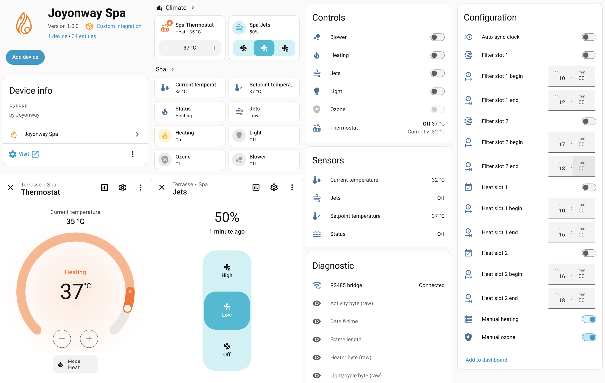

# Joyonway Spa for Home Assistant

**Local Home Assistant integration for Joyonway spa controllers via an RS485-to-IP bridge.**

 

## Overview

This integration brings **local monitoring and control** of **Joyonway** spa controllers into Home Assistant. Communication is purely local via RS485, bridged to your home network through any standard RS485-to-IP Ethernet or WiFi bridge (operating in TCP server mode). No cloud connection, no internet required.

The integration is built with a **modular adapter pattern**, allowing community members to extend support for different controller models (like the P25B85, P23B32, and others) by defining their specific byte maps and command frame formats.

> **Discussion thread:** [JoyOnWay Spa Control — Home Assistant Community](https://community.home-assistant.io/t/joyonway-spa-control/582344)

## Compatibility & Supported Hardware

This integration is designed around a modular model adapter interface to support multiple Joyonway controller models. Since these systems are highly model-specific, integration complexity varies depending on how similar a model's protocol is to the verified reference configuration.

### Support & Integration Effort Rating

Based on community reverse-engineering efforts and sibling codebases, we have mapped the estimated integration difficulty for popular Joyonway models:

| Controller Model | Touchpad Panel | UART Config | Support Status | Integration Difficulty & Assessment |
|---|---|---|---|---|
| **Joyonway P25B85** | PB554 (Colour) | 38400 8N1 | ✅ Supported | **Verified Reference Case:** 100% of read and write commands (pumps, blower, light, heater, setpoint, ozone, datetime schedules) are fully implemented and tested. |
| **Joyonway P23B32** | PB553 (Segment) | 38400 8N1 | ⏳ Extensible | **Low/Medium Effort:** Extremely similar protocol layout and logical framing. Uses the identical 4-byte CRC-32 algorithm. A user can easily write a new model adapter by mapping its custom byte boundaries and command flags. |
| **Joyonway P69B133** | PB562/PB563/PB565 | 38400 8N1 | ⏳ High Effort | **High Effort:** Advanced high-performance controller supporting up to four pumps. Uses a completely distinct framing structure, packet layout, timing boundaries, and command builder. |

### Verified Reference Configuration

For a detailed, step-by-step guide on how to wire the RS485 bridge and configure the adapter software for the reference model, see the [Joyonway P25B85 Setup Guide](docs/p25b85_setup.md).

## Features

- **Current temperature** monitoring (°C)
- **Setpoint temperature** monitoring (°C)
- **Thermostat control** (10°C to 40°C) with fast debounced slider writes, supporting HVAC modes (`HEAT`/`OFF`) to enable/disable the heater directly
- **Jets control** (0% / 50% / 100%) via speed percentage controls
- **Manual ozone** switch (CONFIG category) to toggle between Auto and Manual ozone mode, unlocking the **Ozone** ON/OFF switch
- **Manual heating** switch (CONFIG category) to toggle between Auto and Manual heating mode, unlocking the **Heating** ON/OFF switch
- **Light** on/off via toggle command
- **Blower (air bubbler, optional hardware)** on/off
- **Heat schedule** — 2 time slots with begin/end times and enable/disable
- **Filter schedule** — 2 time slots with begin/end times and enable/disable
- **Auto-sync clock** switch (CONFIG category) to automatically align the spa's internal clock when drift exceeds 30 seconds
- **Status sensor** — off / standby / circulation / heating / ozone (with dynamic icons)
- **Jets sensor** — off / low / high
- **Persistent TCP connection** — real-time state updates (~1–2 s), automatic reconnect with exponential backoff
- **Optimistic UI** — writable entities show immediate feedback; snap back if the spa reports a different state
- **Math-correct CRC-32 generation** — all commands are built dynamically using a reverse-engineered CRC-32 algorithm (standard polynomial `0x04C11DB7` with 32-bit word-swap, detailed in [protocol.md](docs/protocol.md)), preventing potential invalid CRC hazards
- **Bus-safe pacing & serialization** — write commands are paced relative to the RS485 sync frame to avoid bus collisions, managed via a serialized and coalesced intent queue
- Fully local, no cloud, no internet
- English, French, and German UI translations

## Installation

### Via HACS (recommended)

1. Open **HACS** in Home Assistant
2. Click ⋮ (top right) → **Custom repositories**
3. Repository URL: `https://github.com/alexbde/ha-joyonway`
4. Category: **Integration**
5. Click **Add**, then find **Joyonway Spa** and install
6. **Restart Home Assistant**
7. Go to **Settings → Devices & Services → Add Integration → "Joyonway Spa"**

### Manual

1. Copy `custom_components/joyonway/` into your HA `config/custom_components/` folder
2. Restart Home Assistant
3. Add the integration via the UI

## Configuration

After restart, go to **Settings → Devices & Services → Add integration** and search for **Joyonway Spa**.

| Field | Value |
|-------|-------|
| IP address | The IP of your RS485 bridge on the local network |
| TCP port | Bridge listening port (typically `8899`) |

The integration performs a TCP connection test before saving.

> **⚠️ Connection note:** The Elfin EW11 supports up to 4 simultaneous TCP connections. Home Assistant uses one; you can still use debug/capture tools in parallel.

## Entities

The integration exposes entities grouped under the standard Home Assistant device cards:

### Controls

| Entity | Platform | Description |
|---|---|---|
| **Thermostat** | Climate | Target setpoint control (10°C to 40°C) and heater armed state control via HVAC modes (`HEAT`/`OFF`) |
| **Jets** | Fan | Pump speed control (0% / 50% / 100%) |
| **Heating** | Switch | Heating manual ON/OFF (available when **Manual heating** is ON) |
| **Ozone** | Switch | Ozone ON/OFF (available when **Manual ozone** is ON) |
| **Light** | Switch | Light ON/OFF (toggle command with state guard) |
| **Blower** | Switch | Air blower / air bubbler ON/OFF (optional hardware) |

### Sensors

| Entity | Description |
|---|---|
| **Current temperature** | Current water temp in °C |
| **Setpoint temperature** | Current target temperature in °C |
| **Status** | Current operational status (`off`, `standby`, `circulation`, `heating`, `ozone`) with dynamic icons |
| **Jets** | Current jets speed state (`off`, `low`, `high`) |

### Configuration

These entities allow managing the schedules and operating modes of the spa:

| Entity | Platform | Description |
|---|---|---|
| **Manual ozone** | Switch | Toggle Ozone Mode between Auto and Manual |
| **Manual heating** | Switch | Toggle Heating Mode between Auto and Manual |
| **Auto-sync clock** | Switch | Enable/disable automatic clock sync |
| **Heat slot 1/2** | Switch | Enable/disable heating schedule slots |
| **Filter slot 1/2** | Switch | Enable/disable filtration schedule slots |
| **Heat slot 1/2 begin/end** | Time | Heating schedule start and end times (HH:MM) |
| **Filter slot 1/2 begin/end** | Time | Filtration schedule start and end times (HH:MM) |

### Diagnostics

These sensors monitor connection health and expose raw registers for advanced troubleshooting:

| Entity | Platform | Description |
|---|---|---|
| **RS485 bridge** | Binary Sensor | Strict TCP connectivity to the IP bridge (enabled by default) |
| **Date & time** | Sensor | Controller internal date/time as a timestamp sensor (disabled by default) |
| **Heater byte (raw)** | Sensor | Raw byte 14 value shown as hex (e.g. `0x40`, disabled by default) |
| **Pump byte (raw)** | Sensor | Raw byte 12 value shown as hex (e.g. `0x00`, disabled by default) |
| **Ozone mode byte (raw)** | Sensor | Raw byte 13 value shown as hex (e.g. `0x80`, disabled by default) |
| **Activity byte (raw)** | Sensor | Raw byte 28 value shown as hex (e.g. `0x08`, disabled by default) |
| **Light/cycle byte (raw)** | Sensor | Raw byte 17 value shown as hex (e.g. `0x80`, disabled by default) |
| **Frame length** | Sensor | Logical post-unescape frame length in bytes (disabled by default) |
| **Unmapped bytes hash** | Sensor | MD5 fingerprint hash of all unmapped broadcast registers (disabled by default) |

## Contributions & Development

This integration is built as a collaborative community-oriented project! We welcome all contributions, whether it is reverse-engineering new controller models, submitting bug fixes, or improving translations.

For guidelines on setting up your development environment, running unit/simulation tests, reverse-engineering raw telemetry, or understanding the internal architecture, please see the [Contribution & Developer Guide](CONTRIBUTING.md).

## Related Projects

- **[ha-joyonway-p23b32](https://github.com/KnapTheBuilder/ha-joyonway-p23b32)** — HA integration for the P23B32 controller (by christopheknap)
- **[joyonway-frame-analyzer](https://github.com/KnapTheBuilder/joyonway-frame-analyzer)** — Browser-based frame analysis tool for all Joyonway models

## Credits

| Contributor                                                  | Contribution                                                                                     |
|--------------------------------------------------------------|--------------------------------------------------------------------------------------------------|
| **[KDy](https://community.home-assistant.io/u/kdy)**         | Baud rate discovery (oscilloscope), initial P25B85 byte map, pseudo-escape mechanism, CRC safety warning, RS485 bus sync/collision avoidance discovery |
| **[christopheknap](https://github.com/KnapTheBuilder)**      | P23B32 HACS integration, command frame captures, frame analyzer tool                             |
| **[Gaet78](https://community.home-assistant.io/u/gaet78)**   | P69B133 integration                                                                              |
| **[c0mpleX](https://community.home-assistant.io/u/c0mplex)** | Frame samples and community discussion                                                           |

## Disclaimer

This project is **not affiliated with, endorsed by, or connected to Joyonway, Home Deluxe, or any of their subsidiaries or affiliates**. "Joyonway", "Home Deluxe", "White Marble", model numbers (P25B85, PB554, etc.), and any associated logos or product names are trademarks or registered trademarks of their respective owners. All product names, brand names, and images are used solely for identification and compatibility purposes.

This software is provided as-is, without warranty. **Use at your own risk.** The authors accept no liability for any damage to hardware, property, or persons resulting from the use of this integration.

## License

This project is released under the [MIT License](LICENSE).

**Made for the Home Assistant community. 🧖‍♂️**

