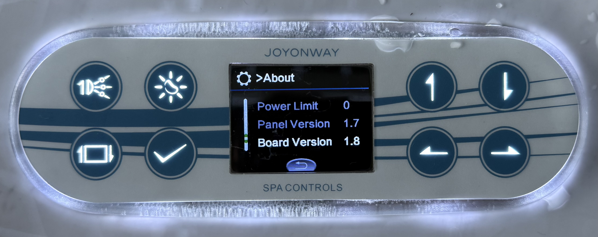
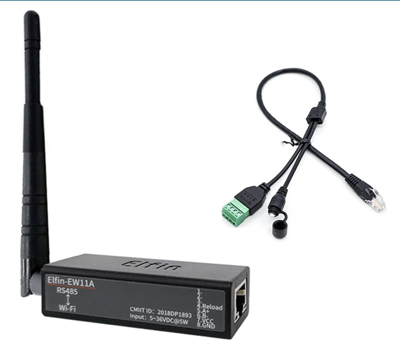
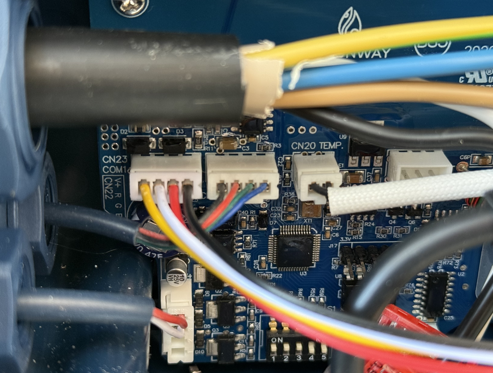
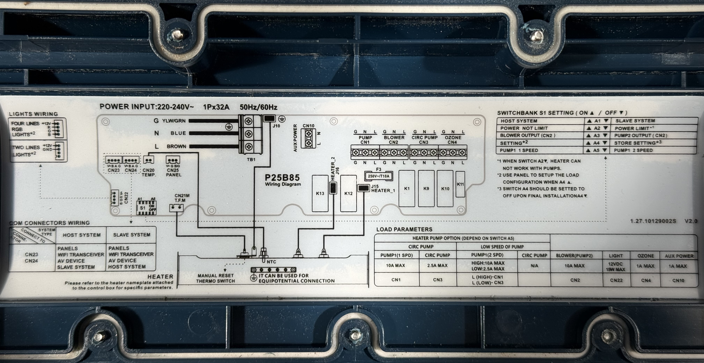
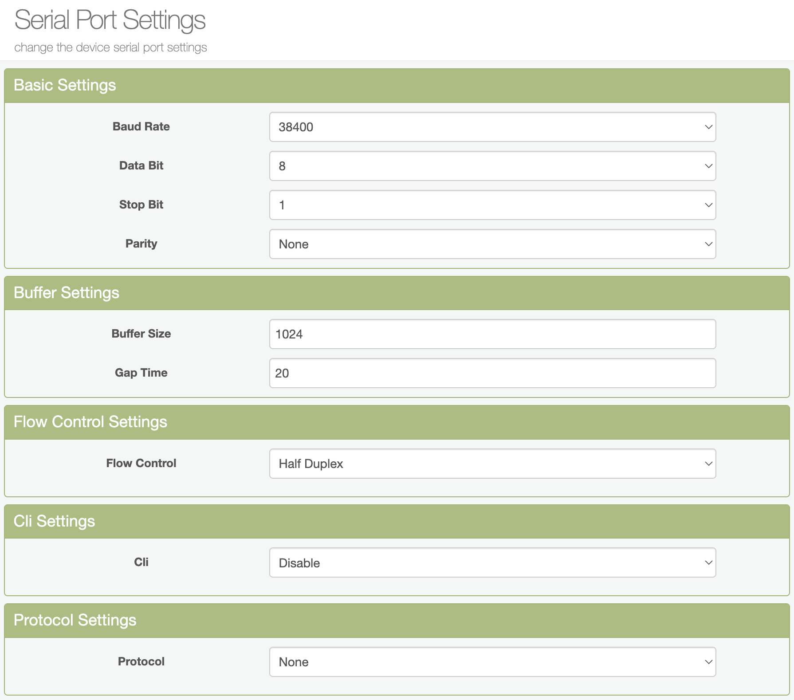
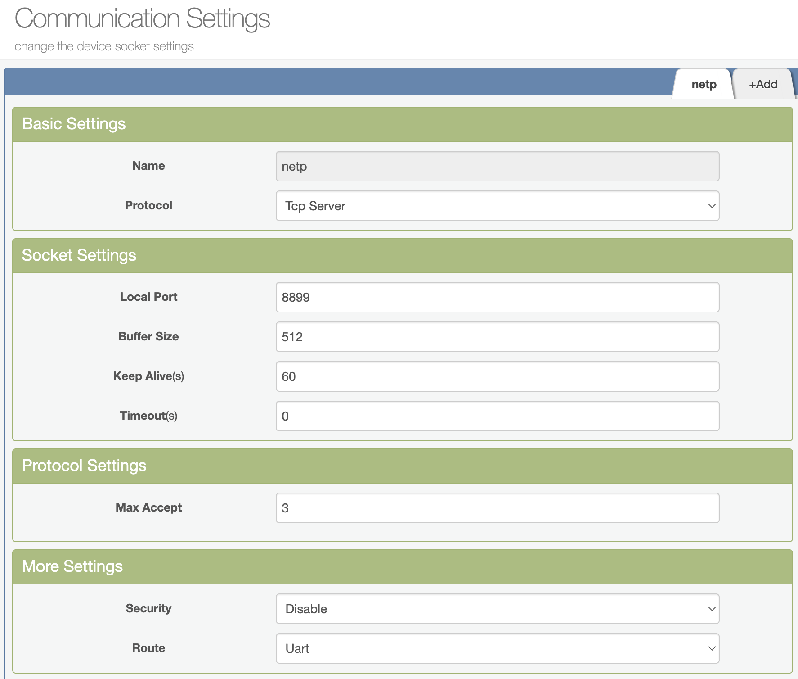

# Joyonway P25B85 Hardware & Software Setup Guide

> [!CAUTION]
> **HARDWARE DAMAGE WARNING & DISCLAIMER:**
> Making physical wiring modifications, opening the controller pack, or sending raw serial commands can potentially damage your spa controller, touchpad, or other electrical equipment.
> This guide is provided for educational and community reference only. The author(s) accept no responsibility or liability for any damage to hardware, property, or persons resulting from following these instructions or using this integration.
> **Proceed at your own risk.** Always turn off the main circuit breaker of the spa before opening the controller pack and making any connections.

This guide describes the hardware and software configuration to integrate the **Joyonway P25B85** spa controller with Home Assistant using an RS485-to-IP bridge (such as the Elfin EW11).

## Overview

The **Joyonway P25B85** (typically paired with the **PB554** color screen touchpad) is the verified reference model for this Home Assistant integration. 100% of read and write commands (pumps, blower, light, heater, setpoint, ozone, datetime schedules) are fully implemented and tested.

### P25B85 Spa Control System


### PB554 Touchpad Display



### Configuration

*   **Spa Model Example:** Home Deluxe White Marble (outdoor rigid/hardshell hot tub)
*   **Touchpad:** PB554 color touchscreen
*   **Controller Pack:** Joyonway P25B85 (PCB `P2325B0003 R05`, sticker says "P25B85-2022")
*   **Heater:** 2 kW resistive, thermostat-controlled
*   **Pumps & Blowers:** 1× dual-speed pump (Massage jets + filtration), optional air blower
*   **Ozone/UV:** Auto or Manual mode via COM port
*   **RS485-to-IP Bridge:** Elfin EW11 WiFi bridge (or similar, e.g. USR-W610, Protoss) configured in **TCP Server mode** on port `8899`.

### Architecture & Data Flow

The diagram below shows the physical layout and network path:

```mermaid
graph TD
    subgraph Home Network
        HA["Home Assistant (Joyonway Integration)"] -- "TCP/IP (Port 8899)" --> Bridge["RS485-to-IP Bridge (e.g. Elfin EW11)"]
    end
    
    subgraph Spa Hardware
        Ctrl["Joyonway P25B85 Controller"] <--> "RS485 Bus" <--> Panel["PB554 Touchpad"]
        Ctrl -- "Power/Control" --> Heater["Heater"]
        Ctrl -- "Power/Control" --> Pumps["Pumps & Blower"]
        Ctrl -- "Power/Control" --> Ozone["Ozone / UV"]
    end

    %% Cross-subgraph connections
    Bridge <--> "RS485 Serial (38400 Baud, CN23/CN24)" <--> Ctrl
```

## Hardware Setup

To establish communication, you need to connect the RS485 bridge directly to one of the COM ports on the main controller pack.

### Required Hardware

The following hardware components are verified for this installation:
*   **RS485-to-IP Bridge:** [Elfin-EW11 WiFi Bridge](https://www.amazon.de/dp/B0FKTHY4NM)
*   **COM Port Cable/Connector:** A compatible 4-pin cable/connector, such as this [4-Pin Connector Cable](https://www.amazon.de/dp/B0CBWX98NF) to interface with the on-board COM headers.



### 1. Locate the COM Ports

On the Joyonway P25B85 controller pack, find the COM ports labeled **CN23** and/or **CN24**. Refer to the wiring diagram located on the inside of the spa pack lid for the exact location and pinouts.



### 2. Identify the Pinout

According to the lid diagram, the CN23 / CN24 COM port pinout has 4 pins:
*   **V+** (DC power supply)
*   **B** (RS485-B)
*   **A** (RS485-A)
*   **GND** (Ground)



### 3. Connect the RS485 Bridge

Connect your RS485 bridge to the COM port: 
*   **RS485 lines:** Connect pin **A** of the controller to **A** of the bridge, and pin **B** to **B** (Red wire = A, White wire = B).
*   **Power lines (Optional):** If your RS485 bridge (like the Elfin EW11) supports wide DC input (e.g. 5-18V or 9-36V depending on the model), you can power it directly from the **V+** and **GND** pins on the board. Always verify the voltage levels and your bridge specs first.

> [!WARNING]
> Always shut down the main power breaker to the spa before opening the controller pack and making any connections.

## Software Setup

Configure the Elfin EW11 RS485-to-IP bridge via its web portal using the parameters below to ensure reliable communication.

### 1. Serial Port Settings

Go to **Serial Port Settings** and configure the interface parameters:
*   **Baud Rate:** `38400` (Note: The P25B85 operates at `38400` baud. Ensure this matches, as any other baud rate will result in frame recognition errors).
*   **Data Bit:** `8`
*   **Stop Bit:** `1`
*   **Parity:** `None`
*   **Flow Control:** `Half Duplex`
*   **CLI:** `Disable`

To avoid timeouts, ensure the buffer size and gap time parameters are optimized so that data frames are forwarded onto the TCP connection immediately without waiting or fragmentation.



### 2. Communication Settings

Set up the network socket to listen for connections from Home Assistant:
*   **Protocol:** `TCP Server`
*   **Port:** `8899` (Default, or your preferred custom port)
*   **Route:** `UART`


